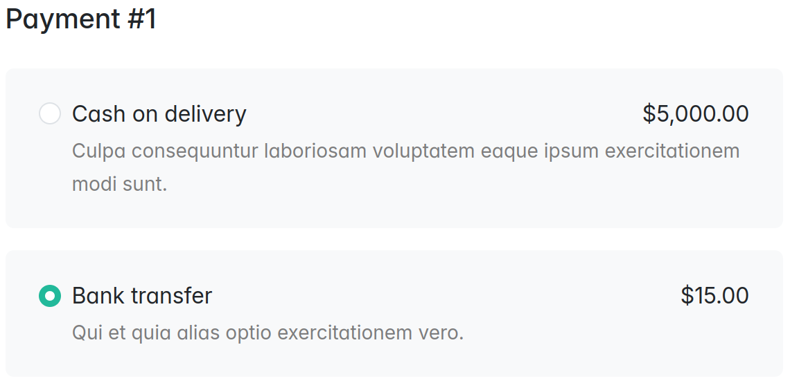

<p align="center">
    <a href="https://www.3brs.com" target="_blank">
        
    </a>
</p>

<h1 align="center">
    Payment Fee Plugin
    <br />
    <a href="https://packagist.org/packages/3brs/sylius-payment-fee-plugin" title="License" target="_blank">
        
    </a>
    <a href="https://packagist.org/packages/3brs/sylius-payment-fee-plugin" title="Version" target="_blank">
        
    </a>
    <a href="https://circleci.com/gh/3BRS/sylius-payment-fee-plugin" title="Build status" target="_blank">
        
    </a>
</h1>

## Features

* Charge extra fee for a payment method
* Typical usage: _Cash on Delivery_
* Taxes are implemented the same way as taxes for shipping fees

### Admin
<p align="center">
 
</p>

### Checkout

<p align="center">
 
 
</p>

## Installation

1. Run `composer require 3brs/sylius-payment-fee-plugin`
2. Add plugin class to your `config/bundles.php`

   ```php
   return [
      ...
      ThreeBRS\SyliusPaymentFeePlugin\ThreeBRSSyliusPaymentFeePlugin::class => ['all' => true],
   ];
   ```
3. Your Entity `PaymentMethod` has to implement `\ThreeBRS\SyliusPaymentFeePlugin\Model\PaymentMethodWithFeeInterface`. You can use Trait `ThreeBRS\SyliusPaymentFeePlugin\Model\PaymentMethodWithFeeTrait`.

   - see [test PaymentMethod](tests/Application/src/Entity/PaymentMethod.php) for inspiration

For guide how to use your own entity see [Sylius docs - Customizing Models](https://docs.sylius.com/en/latest/customization/model.html)

4. **JavaScript Integration** - Register the Stimulus controller for dynamic calculator configuration forms:

   The plugin includes a Stimulus controller (`payment-calculator_controller.js`) that handles dynamic prototype forms for payment method calculator configuration. This allows the calculator configuration fields to appear/change dynamically when you select a calculator type in the admin panel.

   **Manual Steps Required:**

   a. In your application's admin entrypoint file (e.g., `assets/admin/entrypoint.js`):

      ```javascript
      import { startStimulusApp } from '@symfony/stimulus-bridge';
      import PaymentCalculatorController from '../vendor/3brs/sylius-payment-fee-plugin/src/Resources/assets/admin/controllers/payment-calculator_controller';

      // Start Stimulus app
      export const app = startStimulusApp();

      // Register the payment calculator controller from the plugin
      app.register('payment-calculator', PaymentCalculatorController);
      ```

   b. Rebuild your assets after adding the controller:
      ```bash
      yarn install
      yarn build
      ```

   **How it works:**
   - When you select a calculator type (e.g., "Flat rate") in the payment method form, the controller dynamically loads the appropriate configuration fields
   - On the edit page, it preserves existing saved values
   - On the create page, it initializes empty fields for the selected calculator
   - The controller uses Stimulus data attributes: `data-controller="payment-calculator"`, `data-payment-calculator-target="select"`, and `data-payment-calculator-target="container"`

5. Create and run doctrine database migrations:
   ```bash
   bin/console doctrine:migrations:diff
   bin/console doctrine:migrations:migrate
   ```

## Development

### Usage

- Alter plugin in `/src`
- See `bin/` dir for useful commands

### Testing

After your changes you must ensure that the tests are still passing.

```bash
composer install
bin/console doctrine:database:create --if-not-exists --env=test
bin/console doctrine:schema:update --complete --force --env=test
yarn --cwd tests/Application install
yarn --cwd tests/Application build

bin/behat
bin/phpstan.sh
bin/ecs.sh
vendor/bin/phpspec run
```

### Opening Sylius with your plugin

1. Install symfony CLI command: https://symfony.com/download
    - hint: for Docker (with Ubuntu) use _Debian/Ubuntu — APT based
      Linux_ installation steps as `root` user and without `sudo` command
        - you may need to install `curl` first ```apt-get update && apt-get install curl --yes```
2. Run app

   ```bash
   (cd tests/Application && APP_ENV=test bin/console sylius:fixtures:load)
   (cd tests/Application && APP_ENV=test symfony server:start --dir=public --port=8080)
   ```

- change `APP_ENV` to `dev` if you need it

License
-------
This library is under the MIT license.

Credits
-------
Developed by [3BRS](https://3brs.com)<br>
Forked from [manGoweb](https://github.com/mangoweb-sylius/SyliusPaymentFeePlugin).
